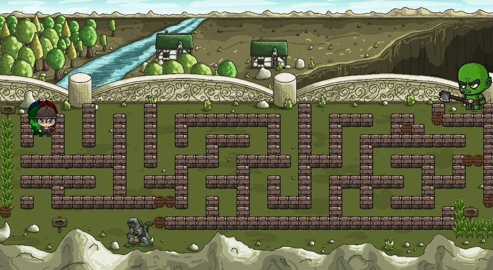

# Medieval Maze v1
Medieval Maze is a multiplayer game 
for up to 4 players and the objective is to solve the maze. The project was made in python 3 using pygame library, threads and sockets.
## Requisites
Python 3.x and pygame.
## Instructions
You need to run the server first
> python server.py

Then you can execute the client up to four times
> python client.py

#### Important 

- Wait for the client to load before executing the next

- The server needs to be restarted whenever the match ends or a player is disconnected

## Screenshots

